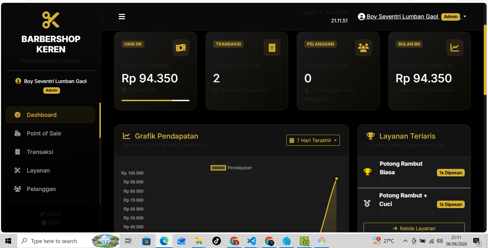
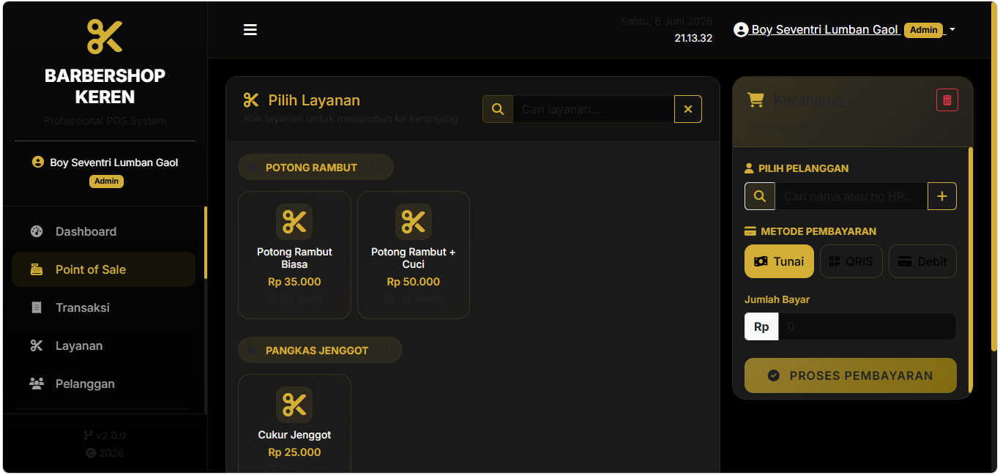
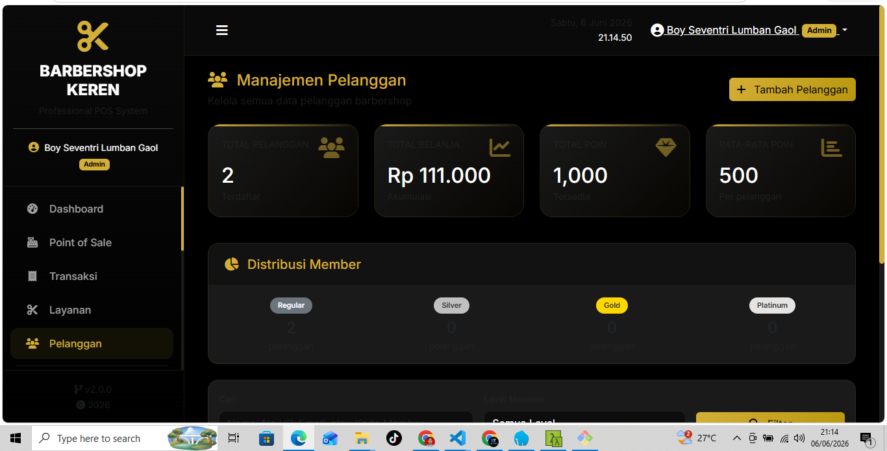

# Barbershop POS

A comprehensive web-based Point of Sale and Business Management System designed specifically for barbershops.

## Features

### Core Features
- **Point of Sale (POS)** - Fast and intuitive transaction processing
- **Appointment Management** - Schedule and manage customer appointments
- **Customer Management** - Track customer history and preferences
- **Employee Management** - Manage staff, schedules, and commissions
- **Revenue Reports** - Generate detailed financial reports and analytics
- **Dashboard Analytics** - Real-time business insights and metrics

## Screenshots

### Dashboard


### POS Transaction


### Customer Management


## Tech Stack

- **Backend:** Laravel 12
- **Admin Panel:** Filament
- **Database:** MySQL
- **Frontend:** Tailwind CSS
- **Other:** Livewire, Alpine.js

## Requirements

- PHP >= 8.2
- Composer
- MySQL >= 5.7
- Node.js & NPM (for asset compilation)

## Installation

### 1. Clone the repository
```bash
git clone https://github.com/yourusername/barbershop-pos.git
<<<<<<< HEAD
cd barbershop-pos
=======
cd barbershop-pos
>>>>>>> 0a6d8f5 (Add project screenshots)
